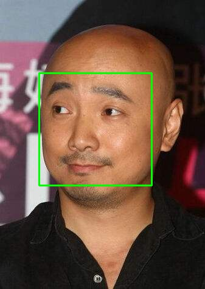
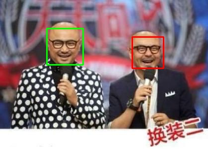

# pyseeta
python api for SeetaFaceEngine(https://github.com/seetaface/SeetaFaceEngine.git)
## For detection & Alignment
|Face Detectin|Face Alignment|
|-|-|
|||

## For identification
|||
|-|-|
|||


# installation
1. Download pyseeta(https://github.com/TuXiaokang/pyseeta.git)
2. `git submodule update --init --recursive`
3. Build `SeetaFaceEngine` dynamic library.

    on unix
    ```bash
    cd SeetaFaceEngine/
    mkdir Release; cd Release
    cmake ..
    make  
    ```
    on windows

    ```bash
    cd SeetaFaceEngine/
    mkdir Release; cd Release
    cmake -G "Visual Studio 14 2015 Win64" ..
    cmake --build . --config Release
    ```
4. the generated dynamic lib is in `SeetaFaceEngine/Release`

5. run test

    on ubuntu or unix
	```bash
	sudo python setup.py install
	python test.py
	```
    on windows
	```bash
	python setup.py install
	python test.py
	```
# tips
If you want to use function of faceidentification, you need decompress the `seeta_fr_v1.0.part.1.rar` which located in `SeetaFaceEngine/model`
